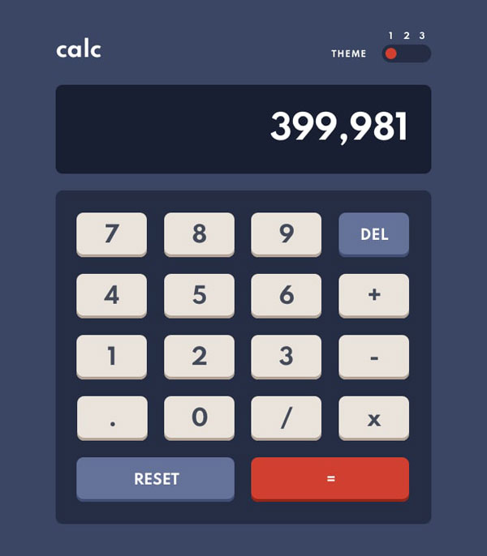
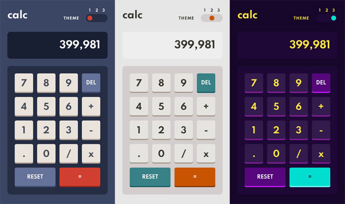

# Frontend Mentor - Calculator app solution

This is a solution to the [Calculator app challenge on Frontend Mentor](https://www.frontendmentor.io/challenges/calculator-app-9lteq5N29).

## Table of contents

- [Overview](#overview)
  - [The challenge](#the-challenge)
  - [Screenshot](#screenshot)
  - [Links](#links)
- [My process](#my-process)
  - [Built with](#built-with)
- [Author](#author)
- [Acknowledgments](#acknowledgments)

## Overview

### The challenge

Users should be able to:

- See the size of the elements adjust based on their device's screen size
- Perform mathmatical operations like addition, subtraction, multiplication, and division
- Adjust the color theme based on their preference
- **Bonus**: Have their initial theme preference checked using `prefers-color-scheme` and have any additional changes saved in the browser

### Screenshot

### Links

- Solution URL: [Calculator-app-solution](https://www.frontendmentor.io/solutions/vue3-vuex-hiyVEL9lS)
- Live Site URL: [Calculator-app](https://skaneris.github.io/Calculator-app/)

## My process

### Built with

- Semantic HTML5 markup
- CSS custom properties
- Flexbox
- CSS Grid
- Mobile-first workflow
- [Vue 3](https://v3.vuejs.org/) - The Progressive JavaScript Framework
- [Vuex](https://next.vuex.vuejs.org/) - State management pattern + library for Vue.js applications

## Author

- Frontend Mentor - [@Skaneris](https://www.frontendmentor.io/profile/Skaneris)
